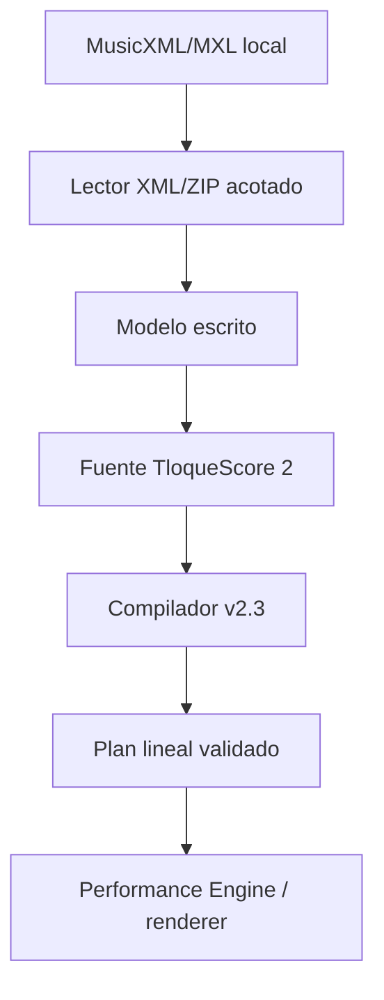

# Puente MusicXML clásico V1

Fecha de contrato: 2026-09-08

Compilador de salida: `tloque-score-compiler-v2.3-classical-import`

Lenguaje conservado: `TLOQUE_SCORE 2`

## Resultado

El compositor de Fonoteca abre `.musicxml`, `.xml` y `.mxl` desde el dispositivo, convierte la obra a TloqueScore determinista y valida el resultado antes de permitir reproducción o guardado. El archivo se procesa en el navegador; al guardar se envía únicamente la fuente TloqueScore y el servidor vuelve a compilarla antes de persistir el plan. La conversión selecciona `module orchestra-synth`, que funciona sin descargar bancos; el administrador puede cambiar después a `native-auto` si ya instaló las fuentes necesarias.

La importación no publica automáticamente. Completa título y compositor cuando existen, marca la licencia como pendiente de verificar y mantiene el activo en borrador.

## Frontera arquitectónica

El importador no llama a Web Audio ni decide la calidad perceptual. Conserva la separación entre fuente, plan, línea temporal y renderer. `seed` deriva de los bytes de texto normalizados y `humanize 0` impide introducir azar durante la conversión.

## Cobertura semántica

| MusicXML | Conversión |
|---|---|
| `score-partwise` y `score-timewise` | Se normalizan a partes y compases en orden de documento. |
| `.mxl` comprimido | Se resuelve `META-INF/container.xml`; se admiten entradas ZIP almacenadas o DEFLATE. |
| `divisions`, `duration`, `chord`, `rest` | Posiciones y duraciones en negras; acordes simultáneos de hasta 12 alturas por evento. |
| `backup`, `forward`, `voice`, `staff` | Se conserva la línea temporal de voces independientes. |
| `tie` / `tied` | Se consolida la nota sostenida sin reataque. |
| `transpose` | Se convierte altura escrita a MIDI sonante mediante `chromatic` y `octave-change`. |
| `time` | Crea secciones con compás propio; admite denominadores 1, 2, 4, 8, 16 y 32. |
| Compás `implicit="yes"` | Deduce su duración escrita para conservar anacrusas sin insertar un compás completo de silencio. |
| `sound tempo` y metrónomo | Se normalizan a BPM de negra; admite unidad y puntillos del metrónomo. |
| Dinámicas y `wedge` | Dinámica a `expression`; reguladores a controles con rampa acotada. |
| Pedal | `pedal=down|up`. |
| `pizzicato`, texto `pizz.` / `arco` | Articulación pizzicato o regreso a arco. |
| Acentos, staccato, tenuto, spiccato, slur, tremolo y harmonic | Articulaciones semánticas TloqueScore disponibles. |
| `midi-program`, nombre de parte e instrumento | Perfil semántico para cuerdas, maderas, metales, teclas, arpa y percusión; fallback General MIDI con aviso. |
| `unpitched` / `midi-unpitched` | Golpe MIDI reproducible en pista de percusión. |

El nombre del archivo queda en la procedencia del borrador y el título y compositor completan sus campos cuando existen. Durante la importación, el panel muestra además el número de partes y el informe de conversión. Las letras no se trasladan: Tloque mantiene su política de música instrumental y lo señala en el informe.

## Aproximaciones visibles

El panel muestra un informe plegable y señala que hace falta revisión antes de publicar cuando ocurre cualquiera de estos casos:

- repetición, casilla o salto de navegación conservado sólo en el orden escrito, sin desplegar la forma;
- tempo o compás interno cuantizado al siguiente límite de compás;
- compás implícito representado con la fracción exacta de su duración escrita;
- conflictos entre partes resueltos con la primera declaración;
- compás aditivo conservado por duración total, sin su agrupación métrica interna, y `senza misura` dentro del compás heredado;
- fermata aproximada como 150 % de la duración escrita;
- apoyatura convertida en ataque corto sin desplazar el pulso;
- microtono redondeado al semitono MIDI;
- adorno sin equivalente conservado como nota base;
- glissando conservado mediante sus alturas escritas, sin barrido continuo;
- regulador mayor que 64 negras limitado por el contrato;
- duración que atraviesa un cambio de tempo normalizada para conservar su final en tiempo de audio;
- varias identidades instrumentales dentro de una sola parte reproducidas con el primer perfil;
- indicación dirigida a un pentagrama aplicada a toda su parte;
- más de 16 partes agrupadas sólo cuando comparten instrumento semántico equivalente.

La conversión se detiene, en vez de omitir música silenciosamente, si quedan más de 16 instrumentos no equivalentes, aparece un compás no representable, una altura sale de MIDI 0..127, una duración individual supera 256 negras o se excede cualquier presupuesto operativo.

## Límites y seguridad

| Recurso | Límite |
|---|---:|
| XML sin comprimir | 12 MB, 500 000 nodos, profundidad 128 |
| Archivo MXL | 16 MB, 256 entradas |
| Entrada MXL | 12 MB descomprimidos |
| Total declarado en MXL | 48 MB |
| Relación de compresión por entrada | 250:1 |
| Fuente TloqueScore | 4 000 000 caracteres |
| Tracks / secciones | 16 / 2 048 |
| Compases / negras / duración | 4 096 / 131 072 / 4 horas |
| Eventos / silencios / controles | 131 072 / 65 536 / 65 536 |

El lector XML rechaza DTD, `ENTITY`, declaraciones desconocidas, entidades no predefinidas, profundidad o cantidad excesiva y XML mal balanceado. El lector MXL rechaza rutas absolutas o con traversal, nombres ambiguos, cifrado, archivos multipartidos, ZIP64, métodos distintos de store/DEFLATE, tamaños fuera de rango y discrepancias entre cabecera local y directorio central. Cada entrada extraída debe coincidir en tamaño y CRC-32; la descompresión también se corta por tamaño durante el streaming.

No se usa `innerHTML` con datos del archivo. Los avisos, nombres y errores se insertan como texto.

## Compatibilidad y rendimiento

- Las recetas guardadas con compiladores `v2`, `v2.1` y `v2.2` siguen siendo válidas; su sección hereda el compás global cuando no contiene `meter`.
- El plan nuevo añade `meter` por sección sin cambiar el encabezado de fuente ni `version: 2`.
- El compilador indexa eventos, silencios y controles una vez por sección. El intérprete indexa secciones por ID y el filtro de silencios usa intervalos ordenados; no hace un barrido completo por cada evento.
- El guardado compacto evita reenviar al servidor un plan enorme. El servidor trata la fuente como autoridad, recompila y persiste solamente el plan verificado.

## Fuentes y licencias

| Fuente | Uso | Código o activos incorporados | Licencia relevante |
|---|---|---|---|
| [W3C MusicXML 4.0](https://www.w3.org/2021/06/musicxml40/musicxml-reference/) | Semántica de elementos y atributos | No | Especificación W3C consultada |
| [Compressed MXL files](https://www.w3.org/2021/06/musicxml40/tutorial/compressed-mxl-files/) | Resolución de `container.xml` | No | Documentación W3C consultada |
| APIs web `TextDecoder` y `DecompressionStream` | UTF-8 y DEFLATE local | No | APIs de plataforma; sin paquete añadido |
| Implementación Tloque | Parser, importador, contrato y pruebas | Sí, código propio | Licencia MIT del repositorio |

No se descargan partituras, muestras ni catálogos externos y no se añadió una biblioteca XML/ZIP. Se evaluó usar un parser general, pero el subconjunto necesario era pequeño y una implementación limitada permite rechazar explícitamente DTD/entidades y fijar presupuestos de memoria. Esta decisión no certifica que las bibliotecas generales sean inseguras; reduce dependencias y superficie de ataque para este flujo local.

## Validación

La suite automatizada cubre partwise, timewise, MXL/DEFLATE, CRC, transposición de clarinete en Si bemol, voces con `backup`/`forward`, ligaduras, acorde, silencios superpuestos, anacrusa implícita, dinámica, regulador, pedal, pizzicato/arco, metrónomo con puntillo, cambio 4/4 a 3/8, rechazo de DTD y compás no representable, guardado compacto y compilación de 500 compases.

Queda fuera de CI y no se presenta como validado:

- escucha comparativa de partituras reales en `builtin`, `orchestra-synth` y `native-auto`;
- prueba táctil y de memoria con archivos MXL grandes en Chrome y Safari móviles;
- contraste visual compás por compás contra Dorico, MuseScore o Finale;
- decisión humana de promover una importación a estado publicado o calidad Master.
