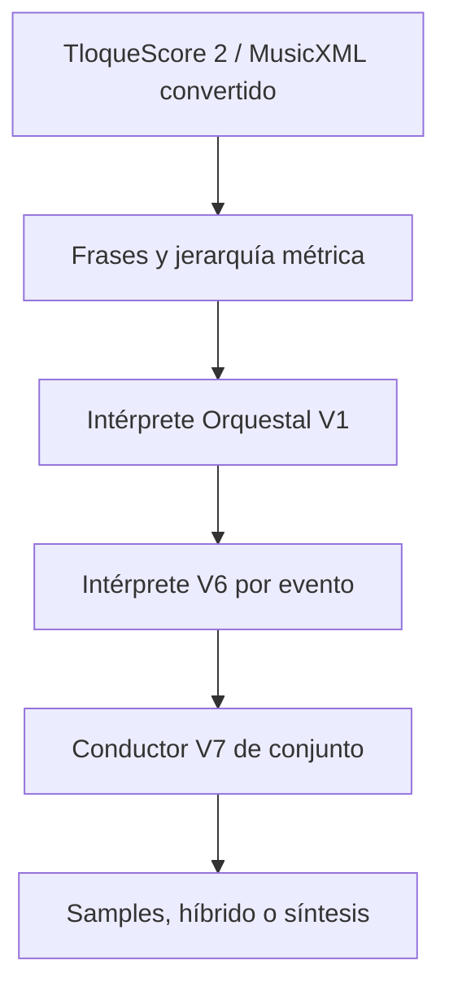

# Intérprete Orquestal V1

Fecha del contrato: 2026-09-08

## Versiones

- Partitura de entrada: `TLOQUE_SCORE 2`.
- Compilador de partitura: `tloque-score-compiler-v2.3-classical-import`.
- Intérprete Orquestal: `tloque-orchestral-interpreter-v1`.
- Reglas: `tloque-orchestral-interpreter-rules-v1-phrase-harmony-expression`.
- Intérprete de ejecución: `tloque-intelligent-performer-v6-orchestral-interpreter`.
- Director universal: `tloque-universal-performance-director-v6-orchestral-interpreter`.
- Conductor de conjunto: `tloque-orchestra-conductor-v7-acoustic-continuity`.

La versión de `TLOQUE_SCORE` no cambia. La interpretación es un artefacto derivado y determinista; no se guarda reescribiendo la partitura del autor.

## Lugar en el pipeline

El Intérprete recibe únicamente el plan musical compilado. No analiza manuscritos, no consulta servicios externos y no decide significado narrativo. La adaptación narrativa sigue perteneciendo al Direction Agent y al Music Brain.

## Decisión por evento

Cada ataque recibe un contrato acotado con:

- fase de frase: entrada, dirección, clímax, llegada o salida;
- intención interpretativa: conexión, sostén, separación, impulso o liberación;
- tensión interválica de la sonoridad simultánea;
- peso melódico y fuerza de llegada;
- curva interna de dinámica con inicio, máximo, final y posición del máximo;
- curva interna de vibrato;
- objetivo tímbrico para mezclar capas de velocity grabadas;
- escalas conservadoras de ataque y release;
- respiración nueva y dirección de arco cuando corresponden;
- razones trazables y versiones de contrato/reglas.

`basis=music-design-heuristic` identifica explícitamente estas decisiones como heurísticas musicales. No son inferencias emocionales, neurológicas ni médicas.

## Análisis musical

### Frase

Se reutilizan los límites deterministas del Director: silencios explícitos, huecos audibles, cambio de sección, duración máxima de frase y posición métrica. El clímax se estima con contorno, velocity, duración, función del track y jerarquía del pulso.

### Armonía

Los ataques escritos en la misma posición forman una sonoridad. Se comparan sus clases de altura, ignorando duplicaciones de octava y percusión sin altura. Segundas, séptimas y tritonos aportan más fricción que terceras, cuartas, quintas u octavas. La cifra resultante sólo regula cantidades pequeñas de esfuerzo y color.

El motor no cambia acordes, no “corrige” armonía y no aplica asociaciones universales como menor=triste.

### Llegada

Una llegada combina final de frase, pulso fuerte, duración sostenida y reducción de tensión respecto al ataque anterior. Esto permite que una cadencia respire y cierre sin imponer una teoría tonal concreta ni inventar notas.

## Aplicación audible

| Destino | Aplicación real |
|---|---|
| Síntesis orquestal | Esfuerzo, brillo, ganancia interna, vibrato, ataque y release. |
| Cuerdas físicas | Presión/arco, cuerpo, brillo, vibrato y continuidad de frase. |
| Lengüetas físicas | Presión, radiación, brillo, vibrato y envolvente de salida. |
| Samples grabados | Curva de ganancia/color, ataque/release y selección/mezcla de capas dinámicas. |
| `native-auto` | Conserva el análisis de la orquesta completa al dividir la obra entre bancos. |
| Escenario | Profundidad, presencia, envío de sala y microseparación determinista según `role=`. |

La selección de capa usa velocity escrita y `expression` en el instante de la nota. La capa puede cambiar de `p` a `f` sin multiplicar nuevamente la amplitud: el selector recibe por separado el objetivo de color y la velocity de ganancia.

## Invariantes y seguridad

- Misma receta, seed y versiones produce decisiones y PCM equivalentes byte a byte en el harness.
- `humanize 0` conserva exactamente ataque, duración y velocity compilados.
- Nunca cambia alturas, articulaciones ni timbres escritos.
- La tensión, saliencia, llegada y curvas permanecen finitas y acotadas.
- La ganancia interpretativa se limita a `0.72..1.16` dentro de una nota.
- El objetivo de capa se limita a `0.01..1` y no aumenta por sí mismo la amplitud.
- El panorama adicional por track no supera aproximadamente `±0.012`.
- Percusión corta y one-shots no reciben vibrato ni curvas sostenidas inventadas.
- Un banco sin articulación, timbre o transición declarada sigue fallando con honestidad o usa el fallback ya autorizado.
- No se añade una dependencia, descarga ni solicitud de red al playback.

## Rendimiento

El análisis agrupa ataques por posición musical y reduce la armonía a un máximo de doce clases de altura. Su coste es lineal en eventos más grupos ordenados; no compara cada nota con toda la obra. Las curvas conservan los límites de puntos ya existentes y los planos espaciales reutilizan un único escenario compartido por track.

## Procedencia y licencias

Código y reglas adoptados en este bloque:

- implementación original del proyecto;
- contrato `TLOQUE_SCORE 2` y puente MusicXML/MXL ya internos;
- especificación W3C MusicXML únicamente como referencia de intercambio del bloque anterior.

No se incorporaron repositorios, modelos, datasets, SoundFonts, muestras, presets ni melodías nuevas. Se excluyeron parsers/motores de terceros y generadores GPL/AGPL porque este bloque no los necesita y porque introducirían superficie técnica o legal sin mejorar el contrato determinista. Los derechos de cada banco siguen gobernados por su manifest y allowlist propios.

## Validación que CI puede demostrar

- estabilidad de planes y mapas espaciales;
- límites numéricos e invariantes de partitura;
- fricción armónica relativa;
- curvas de dinámica/vibrato finitas;
- capa dinámica separada de amplitud;
- identidad de interpretación al particionar `native-auto`;
- PCM distinto frente al gesto neutral, repetible y sin clipping;
- compatibilidad de tipos, pruebas generales y build de producción.

## Validación perceptual pendiente

La finalización técnica no certifica realismo acústico. Aún deben hacerse:

- escucha A/B nivelada contra la versión anterior;
- comparación compás por compás con partituras MusicXML reales;
- escucha con bancos nativos instalados, audífonos y altavoz móvil;
- prueba de Chrome y Safari móvil para CPU, memoria, batería y controles táctiles;
- evaluación humana separada de fraseo, distracción durante lectura, balance y preferencia;
- condición de silencio/sin música como control de producto.
